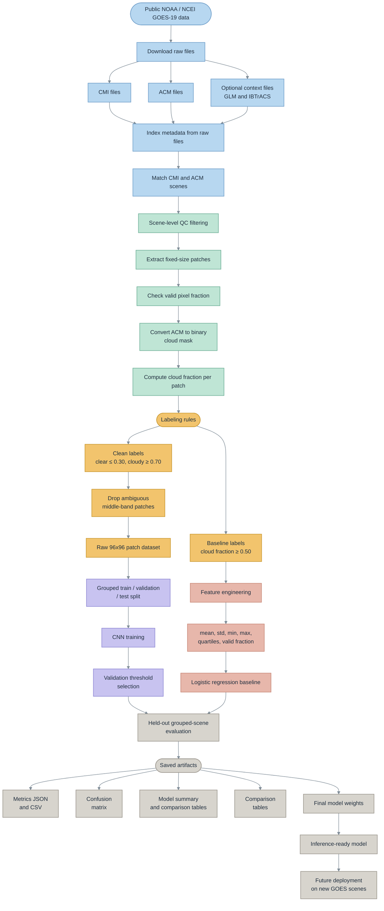

# Scene-Aware Cloud Classification from GOES-19 Satellite Imagery

A binary cloud-vs-clear patch classifier built from real NOAA GOES-19 satellite data. This project curates paired CMI/ACM satellite files, extracts labeled image patches, and compares classical machine learning baselines against a compact CNN — with grouped scene splitting to prevent data leakage.

---

## Results

| Model | Accuracy | Cloud Precision | Cloud Recall | Cloud F1 | Test Patches |
|---|---|---|---|---|---|
| Logistic Regression (Baseline) | 0.8505 | 0.8867 | 0.8202 | 0.8522 | 116,142 |
| Version D (Best Non-CNN) | 0.9157 | 0.9428 | 0.8979 | 0.9198 | 79,725 |
| **Final CNN** | **0.9477** | **0.9434** | **0.9606** | **0.9519** | **79,725** |

The CNN improved over the best non-CNN baseline by +0.032 accuracy, +0.063 recall, and +0.032 F1 on the same held-out grouped-scene test set.

---

## Table of Contents

- [Project Goal](#project-goal)
- [Why This Project Matters](#why-this-project-matters)
- [Pipeline Overview](#pipeline-overview)
- [Data Sources](#data-sources)
- [Data Curation and Cleaning](#data-curation-and-cleaning)
- [Labeling Strategy](#labeling-strategy)
- [Dataset Variants](#dataset-variants)
- [Model Development](#model-development)
- [Baseline Ablation Study](#baseline-ablation-study)
- [Final CNN Architecture](#final-cnn-architecture)
- [Saved Model Weights](#saved-model-weights)
- [Repository Structure](#repository-structure)
- [How to Run](#how-to-run)
- [Tech Stack](#tech-stack)
- [Limitations](#limitations)
- [Future Work](#future-work)

---

## Project Goal

Given a small patch from a GOES-19 satellite image, classify it as **clear** or **cloudy**.

This is a binary image-classification task built from real NOAA remote-sensing data. The project uses:
- **CMI** (Cloud and Moisture Imagery) as the input image source
- **ACM** (Clear Sky Mask) as the supervisory signal for patch labels

Key questions the project was designed to answer:
- Can a simple feature-based model classify cloud vs. clear patches reasonably well?
- Does a cleaner labeling strategy improve performance?
- Do larger image patches help by giving the model more spatial context?
- Does a CNN trained on raw patches outperform a classical model built on summary statistics?

---

## Why This Project Matters

Cloud detection is an important preprocessing step in remote sensing. Unreliable cloud identification contaminates downstream measurements and decisions. This project focuses on a practical, reproducible version of that problem — patch-level cloud classification — rather than full-scene segmentation or weather forecasting.

A core challenge in this type of work is that nearby patches are highly correlated, ambiguous cloud boundaries create noisy labels, and naive train/test splits can inflate accuracy if patches from the same scene leak across splits. This repository addresses all three by emphasizing:

- Careful data curation
- Clean labeling with dropped ambiguous patches
- Grouped scene splitting for fair evaluation

---

## Pipeline Overview



The workflow has three major stages:

1. **Data curation and wrangling** — collect raw GOES files, index metadata, match CMI/ACM scenes, filter invalid pairs
2. **Patch dataset construction** — extract fixed-size patches, compute cloud fraction, apply labeling rules, optionally drop ambiguous patches
3. **Model training and evaluation** — train a feature-based baseline and a CNN, evaluate with grouped scene splits, save outputs and model weights

---

## Data Sources

| Source | Count |
|---|---|
| GOES-19 ABI-L2-CMIPC C13 CONUS files | 529 |
| GOES-19 ABI-L2-ACMC CONUS files | 522 |
| GOES-19 GLM-L2-LCFA files | 1 |
| IBTrACS storm file | `IBTrACS.ALL.v04r01.nc` |
| **Matched CMI/ACM scene pairs** | **521** |

**Data roles:**
- **CMI** — input image source for patch extraction
- **ACM** — cloud mask source for generating patch labels
- **GLM / IBTrACS** — included as contextual metadata during wrangling; not used as direct inputs to the final classifier

---

## Data Curation and Cleaning

A large part of this project was data curation, not modeling.

**Scene matching** — CMI and ACM files were matched only when they shared the same platform, scene, image dimensions, and time overlap. This produced 521 matched scenes.

**Patch extraction** — For each matched scene, a square window slid across both the CMI image and the aligned ACM mask at fixed geometry.

**Validity filtering** — A patch was kept only if at least 90% of its pixels were valid in both arrays.

**Ambiguity handling** — Thin cloud, cloud edges, and transition regions produce weak supervision. Rather than forcing these into hard labels, the strongest pipeline variants dropped middle-band ambiguous patches entirely. This was one of the biggest improvements in the project.

---

## Labeling Strategy

Patch labels come from the ACM cloud mask, not manual annotation.

**Step 1 — Reduce ACM to a binary mask**

| ACM value | Interpretation |
|---|---|
| 0 or 1 | Clear |
| 2 or 3 | Cloudy |

**Step 2 — Compute cloud fraction per patch**

The fraction of valid pixels marked as cloudy becomes the patch-level cloud fraction.

**Step 3 — Assign the patch label**

| Rule | Clear | Cloudy | Ambiguous |
|---|---|---|---|
| Early baseline | < 0.50 | >= 0.50 | — |
| Final clean-label | <= 0.30 | >= 0.70 | dropped |

---

## Dataset Variants

| Dataset | Labeled patches |
|---|---|
| Grouped baseline (64x64) | 461,654 |
| Final cleaned CNN / Version D (96x96) | 316,466 |
| Ambiguous patches dropped | 114,162 |

The best performance came not only from changing the model, but from improving the dataset definition itself.

---

## Model Development

The project was built in two stages:

### Feature-Based Baseline

Instead of the full patch image, the baseline used eight summary statistics per patch:

`mean` · `std` · `min` · `max` · `25th percentile` · `median` · `75th percentile` · `valid-pixel fraction`

These features were passed to a logistic regression classifier with grouped scene splitting.

**Baseline result:**

| Metric | Value |
|---|---|
| Train patches | 345,512 |
| Test patches | 116,142 |
| Accuracy | 0.8505 |
| Cloud F1 | 0.8522 |

---

## Baseline Ablation Study

A step-by-step experiment ladder tested what actually mattered:

| Version | Main change | Accuracy | Precision | Recall | F1 |
|---|---|---|---|---|---|
| A | Threshold 0.45 | 0.8542 | 0.8755 | 0.8425 | 0.8586 |
| B | Threshold 0.45 + class balancing | 0.8522 | 0.8803 | 0.8319 | 0.8554 |
| C | Clean labels + balancing | 0.9069 | 0.9378 | 0.8868 | 0.9116 |
| D | Clean labels + 96x96 patches | 0.9157 | 0.9428 | 0.8979 | 0.9198 |

- **A to B:** Class balancing did not help; threshold tuning had marginal effect
- **B to C:** Dropping ambiguous patches was the single biggest improvement
- **C to D:** Larger spatial context (96x96) produced another meaningful gain

Label quality mattered more than threshold tuning or class weighting. Version D (logistic regression on clean 96x96 patches) became the direct comparison baseline for the final CNN.

---

## Final CNN Architecture

The final model takes raw 96x96 single-channel CMI patches as input.

```
Conv2D (32 filters) -> MaxPooling
Conv2D (64 filters) -> MaxPooling
Conv2D (128 filters) -> MaxPooling
GlobalAveragePooling
Dense (64 units)
Dropout (0.20)
Dense (1 unit, sigmoid)
```

**Training setup:**

| Setting | Value |
|---|---|
| Patch size | 96x96 |
| Patch stride | 64 |
| Min valid pixel fraction | 0.90 |
| Clear threshold | <= 0.30 |
| Cloudy threshold | >= 0.70 |
| Train patches | 188,792 |
| Validation patches | 47,949 |
| Test patches | 79,725 |
| Batch size | 512 |
| Epochs | 13 (early stopping) |
| Decision threshold | 0.45 (selected from validation sweep) |

**Why a custom CNN and not a pretrained backbone?**

- The task is binary and narrowly scoped, not a large multi-class benchmark
- Input is single-channel GOES CMI data, making standard RGB backbones a poor fit
- A compact custom model kept the comparison fair: raw-patch learning vs. summary-statistic learning, with everything else held constant
- Feasible for local Apple Silicon training and rapid iteration

---

## Saved Model Weights

The trained CNN weights are included in the repository via Git LFS.

```
processed/cnn/cnn_best_model.keras
```

Load the model for inference or further evaluation:

```python
from tensorflow import keras

model = keras.models.load_model("processed/cnn/cnn_best_model.keras")
```

---

## Repository Structure

```
weather_classifier/
├── raw/
│   ├── goes_cmi/
│   ├── goes_acm/
│   ├── goes_glm/
│   └── ibtracs/
├── index/
├── processed/
│   ├── matched_scenes.csv
│   ├── patch_dataset.csv
│   └── cnn/
│       ├── cnn_dataset_patch96_clean.npz
│       ├── cnn_dataset_patch96_clean_metadata.csv
│       ├── cnn_dataset_patch96_clean_summary.json
│       └── cnn_best_model.keras
├── reports/
│   ├── experiments/
│   ├── cnn/
│   └── text/
├── scripts/
│   ├── build_indexes.py
│   ├── build_matches.py
│   ├── build_training_data.py
│   ├── train_baseline.py
│   ├── build_cnn_dataset.py
│   ├── train_cnn.py
│   └── run_cnn_pipeline.py
└── README.md
```

---

## How to Run

**1. Build indexes**
```bash
python scripts/build_indexes.py
```
Creates structured metadata tables from raw GOES and storm files.

**2. Match scenes**
```bash
python scripts/build_matches.py
```
Matches compatible CMI/ACM scene pairs by platform, dimensions, and time overlap.

**3. Build the baseline patch dataset**
```bash
python scripts/build_training_data.py
```
Extracts baseline patches and computes summary statistics features.

**4. Train the feature-based baseline**
```bash
python scripts/train_baseline.py
```
Trains and evaluates logistic regression on the engineered patch statistics.

**5. Build the CNN patch dataset**
```bash
python scripts/build_cnn_dataset.py
```
Extracts cleaned 96x96 patches with the clean-label rule applied.

**6. Train the CNN**
```bash
python scripts/train_cnn.py
```
Trains the final CNN, selects the best decision threshold from validation data, and saves metrics, confusion matrices, and model weights.

**7. End-to-end CNN path (convenience wrapper)**
```bash
python scripts/run_cnn_pipeline.py
```

---

## Tech Stack

| Category | Tools |
|---|---|
| Language | Python |
| Environment | Conda / Miniforge |
| Data formats | NetCDF, CSV, JSON, `.keras` |
| Core libraries | `numpy`, `pandas`, `matplotlib`, `xarray`, `netCDF4`, `h5netcdf` |
| ML / modeling | `scikit-learn`, `tensorflow` / Keras |
| Apple Silicon | `tensorflow-metal` |
| Large file storage | Git LFS |

---

## Limitations

- Focuses on binary patch classification, not full-scene segmentation
- Labels come from ACM supervision, not manual expert annotation
- GLM and IBTrACS context data were not used as final model inputs
- Results depend on the clean-label rule and may not generalize to all sensors, seasons, or operational settings
- No production deployment service is currently provided

---

## Future Work

- Inference pipeline for new GOES scenes
- Lightweight prediction service / web API
- Multi-class extension: cloud / thunderstorm / hurricane
- Explicit use of GLM for lightning-related labeling
- Seasonal and temporal generalization tests
- Cross-sensor transfer studies
- Patch-to-scene aggregation
- Full-scene segmentation models
