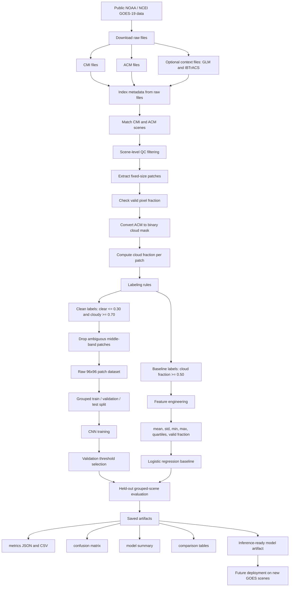

# Scene-Aware Cloud Classification from GOES Image Patches Using a Convolutional Neural Network

## Overview

This project builds a **cloud-vs-clear image classifier** from **GOES-19 Advanced Baseline Imager (ABI)** satellite data. The pipeline starts with paired **Cloud and Moisture Imagery (CMI)** and **Clear Sky Mask (ACM)** products, converts them into labeled image patches, compares multiple feature-based baselines, and then trains a compact **convolutional neural network (CNN)** on the raw image patches.

The main goal was not just to train a model, but to build a **scene-aware and reproducible AI workflow**:

- curate and index raw NOAA satellite files
- match CMI scenes with aligned ACM supervision
- extract and clean labeled image patches
- prevent scene leakage with grouped train/test splitting
- compare classical machine learning against a CNN under the same task definition
- save metrics, confusion matrices, and summary outputs for reproducible evaluation

The final result was a **CNN** that outperformed the strongest non-CNN baseline on the same held-out grouped-scene test set.

---

## Final Takeaway

The strongest model in this project was a **small Keras CNN** trained on cleaned `96x96` GOES-19 CMI patches.

### Final CNN result
- **Accuracy:** `0.9477`
- **Cloud precision:** `0.9434`
- **Cloud recall:** `0.9606`
- **Cloud F1:** `0.9519`
- **Held-out grouped-scene test patches:** `79,725`

### Strongest non-CNN result (Version D)
- **Accuracy:** `0.9157`
- **Cloud precision:** `0.9428`
- **Cloud recall:** `0.8979`
- **Cloud F1:** `0.9198`

### Main conclusion
The project showed that:
1. **label quality mattered a lot**
2. **larger patch context helped**
3. **scene-aware splitting was necessary for fair evaluation**
4. the **CNN was the best model produced in this study**

---

## Table of Contents

- [Project Goal](#project-goal)
- [Why This Project Matters](#why-this-project-matters)
- [Workflow / AI Pipeline](#workflow--ai-pipeline)
- [Submission Artifacts](#submission-artifacts)
- [Data Sources](#data-sources)
- [Data Curation and Cleaning](#data-curation-and-cleaning)
- [Labeling Strategy](#labeling-strategy)
- [Dataset Variants](#dataset-variants)
- [Model Development](#model-development)
- [Baseline Experiments (Ablation Study)](#baseline-experiments-ablation-study)
- [Final CNN Model](#final-cnn-model)
- [Results](#results)
- [Why the CNN Improved Performance](#why-the-cnn-improved-performance)
- [Tech Stack / Dev Tools](#tech-stack--dev-tools)
- [Repository Structure](#repository-structure)
- [How to Run the Pipeline](#how-to-run-the-pipeline)
- [Current Deployment Status](#current-deployment-status)
- [Limitations](#limitations)
- [Future Work](#future-work)

---

## Project Goal

The task in this repository is:

> Given a small patch from a GOES-19 satellite image, classify it as **clear** or **cloudy**.

This is a **binary image-classification** problem built from real NOAA remote-sensing data. The project uses the GOES-19 **CMI** product as the input image source and the GOES-19 **ACM** product as the supervisory signal for patch labels.

The project was designed to answer a few specific questions:

- Can a simple feature-based model classify cloud vs. clear patches reasonably well?
- Does a cleaner labeling strategy improve performance?
- Does using larger image patches help by giving the model more spatial context?
- Does a CNN trained on raw patches outperform a classical model built on summary statistics?

---

## Why This Project Matters

Cloud detection is an important preprocessing step in remote sensing. If a downstream workflow cannot reliably identify cloud-contaminated regions, then later measurements and decisions become less trustworthy.

This project focuses on a practical version of that problem:
- not full-scene segmentation
- not weather forecasting
- not atmospheric retrieval
- instead, **patch-level cloud classification**

That narrower scope makes it possible to build a reproducible machine-learning pipeline while still working with real satellite data and realistic labeling challenges.

A major challenge in this kind of project is that:
- nearby patches are highly correlated
- ambiguous cloud boundaries create noisy labels
- accuracy can be inflated if patches from the same scene leak into both train and test

Because of that, this repository emphasizes:
- **data curation**
- **clean labeling**
- **grouped scene splitting**
- **fair model comparison**

---

## Workflow / AI Pipeline

---

## Submission Artifacts

Large generated datasets and model artifacts are included with the submission through Git LFS. The full inventory is documented in `reports/SUBMISSION_FILES.md`.

| Path | Size | Purpose | Storage |
| --- | ---: | --- | --- |
| `processed/cnn/cnn_dataset_patch96_clean.npz` | 1.8 GB | Clean `96x96` CNN patch arrays, `316,466` patches | Git LFS |
| `processed/cnn/cnn_dataset_patch96_clean_metadata.csv` | 145 MB | Per-patch metadata for the clean CNN dataset | Git LFS |
| `processed/patch_dataset.csv` | 284 MB | Baseline patch feature and label table | Git LFS |
| `processed/patch_dataset_arrays.npz` | 16 MB | Baseline patch arrays | Git LFS |
| `processed/cnn/cnn_best_model.keras` | 1.2 MB | Final Keras CNN model artifact | Git LFS |

The `reports/` directory contains the small summary files, metrics, and visual outputs that describe these artifacts.
